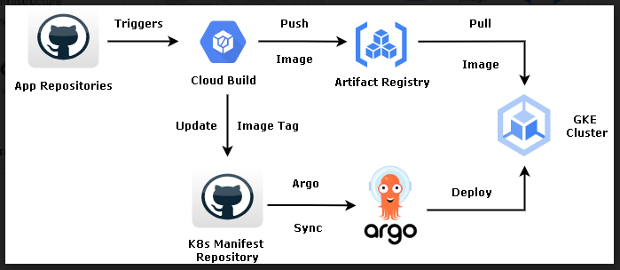

# Evmos Validator on Google Kubernetes Engine

Evmos GCP aims to provide a configured EVMOS `Testnet` validator, a Google Kubernetes Engine (GKE) environement and a CI/CP pipeline for automation purposes.


## Summary Table

- [Features](##features)
- [Prerequisites](#prerequisites)
- [GKE Cluster Creation on GCP](#gke-cluster-creation-on-gcp)
- [ArgoCD Installation](#argocd-instalation)
- [Creation of a private GKE cluster](#creation-of-a-private-gke-cluster)
- [Multi-Cluster Management with ArgoCD](#multi-cluster-management-with-argocd)
- [Monitoring Setup](#monitoring-setup)
- [Deployment of the Evmos Application](#deployement-of-the-evmos-application)
- [Continuous Integration (CI) Pipeline](#continuous-integration-ci-pipeline)
- [Troubleshooting](#troubleshooting)
- [Sources](#sources)
- [Join Evmos Validator's Community](#join-evmos-validators-community)

## Features

`k8s` directory
- Terraform manifests to deploy GKE clusters on Goocle Cloud Platform (GCP):
    * Public cluster (could be used to run sentry nodes)
    * Private cluster to keep validator(s) isolated
    * Gateway controller or Athos Service Mesh Gateway
    * Monitoring with Promethus and Grafana

`Evmos` directory
- `manfiests` for deployment of the Evmos validator. Watched by ArgoCD
- `testnet-validator` Dockerfile with a set of script following different fashions of setting a testnet validator

`ArgoCD` directory
- ArgoCD install for Continuous Deployment
    - ArgoCD for multi-cluster application management

Instructions to set CI/CD Pipelines with Google CloudBuild script and associated template


# Prerequisites

## Install Terraform
Download and install Terraform from the official website: https://www.terraform.io/downloads.html

## Google Cloud Platform Setup
Create a Google Cloud Project, if you don't have one already.
Enable the Kubernetes Engine API for your project.
Create a Service Account with the necessary permissions for Terraform to manage resources in your GCP project.

## Configure Gcloud SDK

Install https://cloud.google.com/sdk/gcloud/
Install gke-gcloud-auth-plugin for use with kubectl by following the instructions (here)[https://cloud.google.com/blog/products/containers-kubernetes/kubectl-auth-changes-in-gke]

## Install Kubectl, Gcloud CLI, gke-gcloud-auth-plugin & Argo CLI
```bash
sudo apt-get install apt-transport-https ca-certificates gnupg curl sudo
echo "deb [signed-by=/usr/share/keyrings/cloud.google.asc] https://packages.cloud.google.com/apt cloud-sdk main" \
    | sudo tee -a /etc/apt/sources.list.d/google-cloud-sdk.list

sudo apt-get update
sudo apt-get install google-cloud-sdk-gke-gcloud-auth-plugin
sudo apt-get install kubectl
```
Configure kubectl
[GCloud doucentation on kubctl auth changes](https://cloud.google.com/blog/products/containers-kubernetes/kubectl-auth-changes-in-gke?hl=en)

```bash
gcloud container clusters get-credentials $(terraform output -raw kubernetes_cluster_name) --region $(terraform output -raw region)
```
Install ArgoCLI: https://github.com/argoproj/argo-workflows/releases/latest

# GKE Cluster Creation on GCP

Creates a VPC and subnet for the GKE cluster. This is  highly recommended to keep GKE clusters isolated.
Terraform apply
```bash
cd k8s/public-cluster
terraform init
terraform apply
```

Verify with gcloud CLI
```bash
gcloud container clusters describe $(terraform output -raw kubernetes_cluster_name) --region us-central1 --format='default(locations)'
```
Expected output should be similar to this
    locations:
    - europe-west1-b
    - europe-west1-c


## Install Kubernetes Dashboard (optional)

```bash
kubectl apply -f https://raw.githubusercontent.com/kubernetes/dashboard/v2.7.0/aio/deploy/recommended.yaml
```

Use kubectl port forwaring to access the Web UI

## Admin user setup
```bash
kubectl apply -f kubernetes-dashboard-admin.rbac.yaml
```

Generate Token
```bash
kubectl -n kube-system describe secret $(kubectl -n kube-system get secret | grep service-controller-token | awk '{print $1}')
```

# ArgoCD Instalation


Run Terraform code in argocd directory
```bash
cd argocd
terraform init
terraform apply
```
For a secure setup exposed to the public Internet a proper TLS setup with OAuth2 and/or SAML authentication is required.
More on this topic here:
 - https://argo-cd.readthedocs.io/en/stable/operator-manual/security/
 - https://argo-cd.readthedocs.io/en/stable/operator-manual/tls/


Verify the instalation
```bash
gcloud auth login
kubectl get all -n argocd
```

For demonstration purpose we can access access ArgoCD using port-forwading over http.
Fetch the default admin user's password
```bash
kubectl -n argocd get secret argocd-initial-admin-secret -o jsonpath="{.data.password}" | base64 -d
```
Login ArgoCD CLI with user admin & password fetched in previous command.

```bash
argocd login --port-forward --port-forward-namespace argocd --plaintext
```

As an alternative change the argocd-server service type to `LoadBalancer`:

```bash
kubectl patch svc argocd-server -n argocd -p '{"spec": {"type": "LoadBalancer"}}'
```

**If you decide to use port forwarding instead of loadbalancing you need to add the following after all ArgoCD commands**

`--port-forward --port-forward-namespace argocd --plaintext`


More info on connecting to ArgoCD is available on the official documentation:

- [Getting Started](https://argo-cd.readthedocs.io/en/stable/getting_started/)
- [Understand The Basics](https://argo-cd.readthedocs.io/en/stable/understand_the_basics/)


## Test ArgoCD setup with a basic Nginx app

Let's use a simple Nginx Deployment Test on ArgoCD's GKE cluster
Fetch argocd password and login to the cli

Create a new ArgoCD deployment of test nginx app
```bash
argocd app create argocd-demo --repo https://github.com/gregsio/argocd-demo --path yamls --dest-namespace default --dest-server https://kubernetes.default.svc
```

# Creation of a private GKE cluster
```bash
cd k8s/private-cluster
terraform init
terraform apply
```

Add the newly created cluster's credentials/context to your kubeconfig
```bash
gcloud container clusters get-credentials private-cluster-us --region=us-central1
```


# Multi-Cluster Management with ArgoCD

## Add a New GKE Private Cluster to ArgoCD


```bash

gcloud container clusters list --region=us-central1

NAME                LOCATION     MASTER_VERSION  MASTER_IP      MACHINE_TYPE  NODE_VERSION    NUM_NODES  STATUS
private-cluster-us  us-central1  1.27.3-gke.100  10.0.0.2       e2-medium     1.27.3-gke.100  1          RUNNING
public-cluster-us   us-central1  1.27.3-gke.100  34.68.198.203  e2-medium     1.27.3-gke.100  3          RUNNING

kubectl config get-contexts
argocd cluster add private-cluster-us --port-forward --port-forward-namespace argocd --plaintext
argocd cluster list --port-forward --port-forward-namespace argocd --plaintext
```
 the ouput should show both cluster as follow

        SERVER                          NAME                                      VERSION      STATUS      MESSAGE  PROJECT
        https://34.16.114.206           gke_evmos-us-central1_gke-private-us1       1.27     Successful
        https://kubernetes.default.svc  in-cluster                                  1.27     Successful

## Install the Nginx test App on the private GKE cluster

```bash
    argocd app create argocd-demo
        \--repo https://github.com/gregsio/argocd-demo
        \--path yamls
        \ --dest-namespace default
        \--dest-server https://34.16.114.206
```
# Monitoring Setup

## Kubernetes Cluster Monitoring

Clone kube-prometheus

```bash
git clone https://github.com/prometheus-operator/kube-prometheus.git
cd kube-prometheus
```
Install Promotheus & Graphana in a `monitoring` namespace
```bash
kubectl apply --server-side -f manifests/setup

kubectl wait \
	--for condition=Established \
	--all CustomResourceDefinition \
	--namespace=monitoring
kubectl apply -f manifests/
```

## Access Grafana or Promotheus WEB UI

Access via port forwarding:

```bash
kubectl --namespace monitoring port-forward svc/prometheus-k8s 9090
kubectl --namespace monitoring port-forward svc/grafana 3000
```
# Deployement of the Evmos Application

The Evmos/testnet directory contains a custom set of scripts and a Dockerfile to configure an *Evmos* testnet node using any of the following approaches:

- Fecthing Genesis file (default setup)
- Snapshot sync
- State sync

Update the k8s/manifests/statfulset.yaml if you want to use a different script at startup
The 3 scripts are in the container's PATH.

## Monitoring

 Follow this instructions: [Graphana Cosmos Dashboard](https://github.com/zhangyelong/cosmos-dashboard)

The testet-validator Docker container is already configure with the following thanks to the `evmos/tesnet-validator/testnet_node.sh` script.
```bash
		sed -i 's/prometheus = false/prometheus = true/' "$CONFIG"
		sed -i 's/prometheus-retention-time  = "0"/prometheus-retention-time  = "1000000000000"/g' "$APP_TOML"
```

The tendermint metrics, is accessible on port is 26660 as configured by `evmos/manifests/service.yaml` & `evmos/manifests/statefulset.yaml`

The Prometheus config requires an update to [add aditional targets](https://github.com/zhangyelong/cosmos-dashboard#configure-prometheus-targets)


## Use ArgoCD for Continuous Deployment(CD Pipeline)

ArgoCD continuously monitors the git repository for any changes that happen and then pulls the changes. It compares the current state of the deployed application with the desired state in the git repository and then applies the changes by automatically deploying the manifest on the GKE cluster.


Create the *Evmos* application in ArgoCD via ArgoCD CLI

```bash
argocd app create evmos \
    --repo https://github.com/gregsio/evmos-gcp \
    --path evmos/manifests \
    --revision main \
    --dest-namespace evmostestnet \
    --dest-server  https://kubernetes.default.svc \
    --port-forward --port-forward-namespace argocd --plaintext
```

Deployment for private cluster

```bash
argocd app create evmos \
    --repo https://github.com/gregsio/evmos-gcp \
    --path evmos/manifests \
    --revision main \
    --dest-namespace evmostestnet \
    --dest-server  https://35.193.253.172 \   ## change to match with your setup
    --port-forward --port-forward-namespace argocd --plaintext
```


Deployement Workflow:

0. Fork this repo
1. Build the Docker image using the provided Dockerfile
2. Push it to a remote Docker repository
3. Update the *image* reference in the *manifests/statefulset.yaml* and commit
4. Sync the *Evmos* application with ArgoCD UI

You can also activate ArgoCD auto sync, so k8s manifets are applied.
To automate the steps detailed in this section keep reading...

# Continuous Integration (CI) Pipeline

- The Infrastructure code (k8s directory) such as VPCs setup and GKE clusters setup is automated using *TerraformCloud*.

- The Continuous Integration of the Evmos validator application is done using *Google CloudBuild*.

Continuous Integration WorkFlow

When a developper make a change to the code, and pushes it to the application repository,
Cloud build then invokes triggers either manually or automatically by the events on the repository such as pushes or pull requests.

Once the trigger gets invoked by any events, cloud build then executes the instructions written in the build config file (cloudbuild.yaml) such as building the docker image from Dockerfile provided and pushing it to the artifact registry configured.
Once the image with the new tag got pushed to the registry, it will get updated in the Kubernetes manifest repository.


## Evmos Validator CI Pipeline
This section automates the steps outlined in "Semi-automated Deployement Workflow".
2 CI files are provided to achieve this:
- `evmos/manifests/statefulset.yaml.tpl`
- `evmos/testnet/cloudbuild.yaml`

Prerequistes:
- Move the code under evmos/testnet to a *separate* GitHub *source repository* (hard requirement)

### Configuring Cloud Build GitHub Trigger

To set up the GitHub trigger we first need to connect to the *source repository* and then configure a trigger. The steps involved in connecting the cloud build to the source repository are given [here](https://cloud.google.com/build/docs/automating-builds/create-manage-triggers#connect_repo).

Once the repository got connected we can configure a trigger by following the steps given [here](https://cloud.google.com/build/docs/automating-builds/create-manage-triggers#build_trigger).

You should now have a cloud build trigger that is connected to your *source repository*

Go to CloudBuild GCP console
- Add the three environmental variables we are using in the cloud build steps
- Associate a custom service account, see further info on `user-specified service accounts` setup [here](https://cloud.google.com/build/docs/securing-builds/configure-user-specified-service-accounts)

```
"roles/iam.serviceAccountUser",
"roles/logging.logWriter",
"roles/secretmanager.secretAccessor",
"roles/artifactregistry.writer"
```

**SUBSTITUTION VARIABLES**  [more info here](https://cloud.google.com/build/docs/configuring-builds/substitute-variable-values)
`_ARTIFACT_REPO` your *source repository* name
`_CD_BRANCH` your *source repository* branch
`IMAGE_TAG` set to `$BRANCH_NAME#*`

'_ARTIFACT_REPO’ is used to set the artifact repository name. we can pass the repository name based on our environment like dev, stage, prod, or on your personal choice.
The variable ‘_CD_BRANCH’ refers to the branch of the second git repository i.e the Kubernetes manifest repository.

The third variable ‘_IMAGE_TAG’ will be used to assign a custom tag based out of branch name or release tag



## K8s Clusters CI Pipeline

With Terrform Cloud the Terrafrom state files will be safely stored encrypted at rest and GCP credentials will be safely stored as well, more info on [HashiCorp documentation](https://developer.hashicorp.com/terraform/cloud-docs/workspaces/variables/managing-variables#sensitive-values)


- See prerequisites section [here](https://developer.hashicorp.com/terraform/tutorials/cloud/kubernetes-consul-vault-pipeline#prerequisites)
- Configure 2 different Terraform Cloud workspaces & GitHub repositories pointing respectively to `k8s/private-cluster` & `k8s/public-cluster
- Configure run triggers, see documentation (here)[https://developer.hashicorp.com/terraform/tutorials/cloud/cloud-run-triggers#configure-a-run-trigger]


# Troubleshooting

## Master Authorized Network
When creating a private cluster with a [private endpoint](https://cloud.google.com/kubernetes-engine/docs/how-to/authorized-networks#benefits_with_private_clusters) (`enable_private_endpoint = true`),
your cluster will **not** have a publicly addressable endpoint.

When using this setting, any CIDR ranges listed in the `master_authorized_networks` configuration *must* come from your private IP space.
If you include a CIDR block outside your private space, you might see this error:

```
Error: Error waiting for creating GKE cluster: Invalid master authorized networks: network "73.89.231.174/32" is not a reserved network, which is required for private endpoints.

  on .terraform/modules/gke-cluster-dev.gke/terraform-google-kubernetes-engine-9.2.0/modules/beta-private-cluster/cluster.tf line 22, in resource "google_container_cluster" "primary":
  22: resource "google_container_cluster" "primary" {
```

To resolve this error, update your configuration to either:

* Enable a public endpoint (with `enable_private_endpoint = false`)
* Update your `master_authorized_networks` configuration to only use CIDR blocks from your private IP space.


# Sources

- [Terraform Google modules](https://github.com/terraform-google-modules)
- [Terraform Google Kubernetes Engine module](https://github.com/terraform-google-modules/terraform-google-kubernetes-engine)
- [Why Deploy with Terrafrom?](https://developer.hashicorp.com/terraform/tutorials/kubernetes/gke#why-deploy-with-terraform)

## Evmos's documentation

- [Validator Minimum Requirements](https://docs.evmos.org/validate/#minimum-requirements)
- [Run a Validator](https://docs.evmos.org/validate/setup-and-configuration/run-a-validator)
- [Common Problems](https://docs.evmos.org/validate/setup-and-configuration/run-a-validator#common-problems)
- [Testnet Documentation](https://docs.evmos.org/validate/testnet)
- [Testnet Faucet](https://faucet.evmos.dev/)

# Join Evmos Validator's Community

- [Evmos Discord Channel](https://discord.com/invite/evmos)